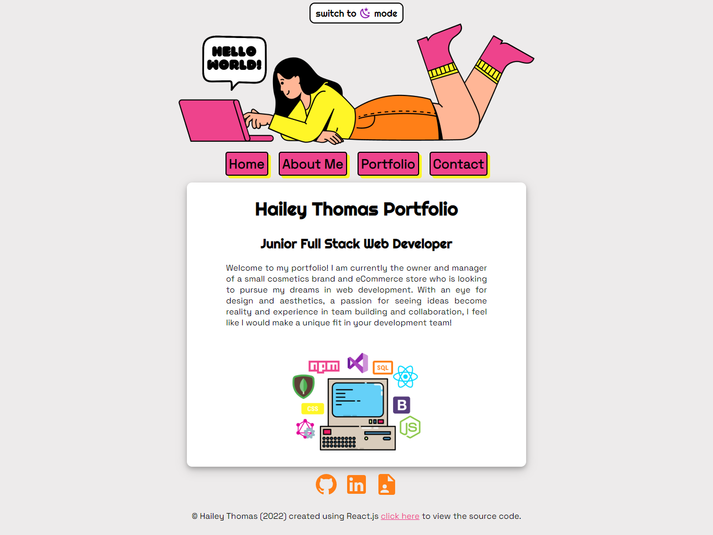
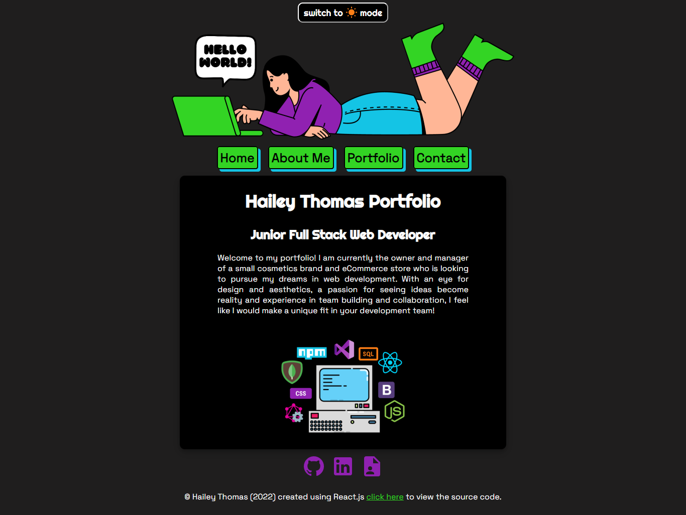

# Portfolio v3

## Description

I decided to redo my portfolio now that I have graduated from University of Arizona Coding Boot Camps to reflect the new things I have learned since gratuation. I am most proud of the dark mode and light mode feature and am happy with how smoothly the project went.

## Table of Contents

- [Usage](#usage)
- [Credits](#credits)
- [License](#license)

## Usage

To use my portfolio, open the React App in your web browser using the link below and then click on the various button in the navigation to travel around. In portfolio you can filter project by front-end, back-end, and full stack as well as expand the project details into a pop up modal. There is also a working contact form and the option to download my resume.

### Screenshot

 

### Links

- [DeployedLink](https://haileythomas.github.io/portfolio-v3/) - link to deployed website
- [GitHub](https://github.com/HaileyThomas/portfolio-v3) - link to GitHub project

## Credits

Created using React.js, React-Router-Dom, Material Design Icons, EmailJS, and pure CSS.

## License

[License](https://opensource.org/licenses/MIT) - link to license

MIT License

Copyright (c) [2022] [Hailey Thomas]

Permission is hereby granted, free of charge, to any person obtaining a copy
of this software and associated documentation files (the "Software"), to deal
in the Software without restriction, including without limitation the rights
to use, copy, modify, merge, publish, distribute, sublicense, and/or sell
copies of the Software, and to permit persons to whom the Software is
furnished to do so, subject to the following conditions:

The above copyright notice and this permission notice shall be included in all
copies or substantial portions of the Software.

THE SOFTWARE IS PROVIDED "AS IS", WITHOUT WARRANTY OF ANY KIND, EXPRESS OR
IMPLIED, INCLUDING BUT NOT LIMITED TO THE WARRANTIES OF MERCHANTABILITY,
FITNESS FOR A PARTICULAR PURPOSE AND NONINFRINGEMENT. IN NO EVENT SHALL THE
AUTHORS OR COPYRIGHT HOLDERS BE LIABLE FOR ANY CLAIM, DAMAGES OR OTHER
LIABILITY, WHETHER IN AN ACTION OF CONTRACT, TORT OR OTHERWISE, ARISING FROM,
OUT OF OR IN CONNECTION WITH THE SOFTWARE OR THE USE OR OTHER DEALINGS IN THE
SOFTWARE.

### Contact

- [Email](mailto:haileyraethomas@gmail.com) - Email Hailey Thomas : haileyraethomas@gmail.com
- [GitHub](https://github.com/HaileyThomas) - GitHub username : HaileyThomas
